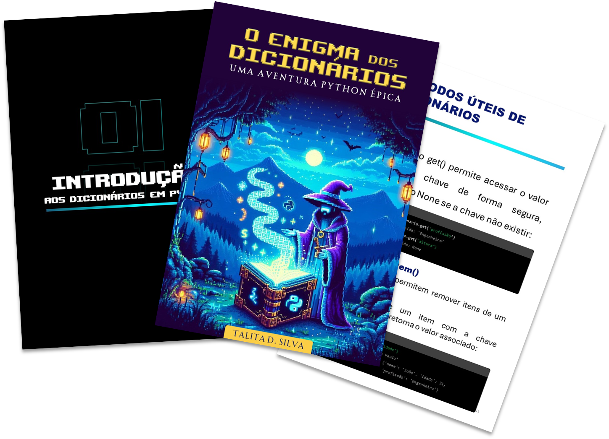

    

-------

# Projeto EBOOK Gerado por I.A.s

 > ℹ️ **NOTE:** Este é o repositório desenvolvido durante o curso no qual fui aluna na plataforma da [DIO](https://dio.me)

Projeto com o objetivo de gerar um ebook digital com as facilidades das ferramentas de IA. todos os prompts
seguem abaixo.

<a href="https://github.com/talitasdias/prompts-recipe-to-create-a-ebook/blob/main/output/ebook-o-enigma-dos-dicionarios-uma-aventura-python-epica.pdf" title="View PDF now"> 📕Clique aqui para ler</a>

## 💻 Tecnologias utilizadas no projeto

- [ChatGPT](https://chat.openai.com/) 
- [Bing](https://www.bing.com/images/create)
- [PowerPoint](https://www.microsoft.com/en/microsoft-365/powerpoint)

## 🧠 Prompts

ChatGPT：

|   Ação   | prompt                                                                                                                                                                                                                                                                         |
| :------: | ------------------------------------------------------------------------------------------------------------------------------------------------------------------------------------------------------------------------------------------------------------------------------ |
|  título  | crie um título de um ebook sobre o tema Python, o ebook é do nicho de programaçao e o subnicho é de Python, sendo específico para o conteudo sobre dicionários, o título deve ser épico e curto, e tenha uma temática de jogo no título, me liste 5 variações de títulos                                                        |
| conteúdo | Faça um texto para ebook , com foco em dicionários do Python, explicando principais conceitos e métodos com exemplos em código. Faça a separação por capítulos. Explique sempre de uma maneira simples. Deixe o texto enxuto. Sempre traga exemplos de código em contextos reais. Sempre deixe um título sugestivo por tópico |

Bing:

|  Ação  | prompt                                                                                 |
| :----: | -------------------------------------------------------------------------------------- |
| título | Create a pixel art scene: Setting: A mystical fantasy world with misty mountains and glowing enchanted trees. Character: A wizard-programmer in pixel art, holding an ancient open grimoire with floating Python code. Include: An ancient vault emitting neon blue light. Style: Use vibrant neon blue colors. |

## ✨ Features

- Conteúdo gerado via ChatGPT
- Imagens geradas via Bing

## 📚 Materiais

- Imagens utilizadas em `assets`
- ebook gerado durante as aulas em `output`

## 🛠️ Instruções de execução

Utilize os prompts acima nas ferramentas sugeridas para gerar o material base e utilize uma ferramenta de edição de documentos como power point, libreoffice , indesign para diagramação.

## 👨‍💻 Autor

    
    
&nbsp&nbsp&nbspTalita Dias 
    &nbsp&nbsp&nbsp
    <a href="https://github.com/talitasdias">
    GitHub</a>&nbsp;|&nbsp;
    <a href="www.linkedin.com/in/talita-dias-dev-tester">LinkedIn</a>
&nbsp;|&nbsp;

  

---

⌨️ com 💜 por [Talita Dias](https://github.com/talitasdias)
